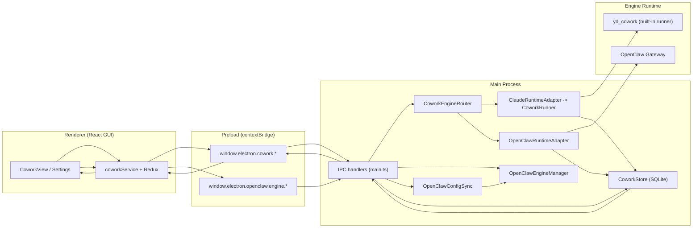
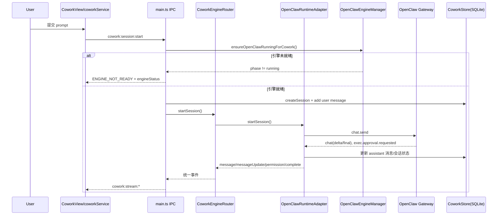

# LobsterAI 架构说明：OpenClaw、GUI 与 Cowork 的关系

> 本文档详细描述 LobsterAI 的核心架构关系，包括数据流、模块依赖、通信机制和配置存储。
> 最后更新：2026-03-24

## 1. 一句话结论

- `Cowork` 是产品能力层（会话、消息、权限、状态流转）。
- `OpenClaw` 是 `Cowork` 的一个可切换执行引擎（另一个是内置 `yd_cowork`）。
- `GUI` 通过 Electron IPC 驱动 `Cowork`，并通过独立的 `openclaw:engine:*` 通道管理 OpenClaw 运行时状态。

换句话说：**GUI 不直接承载业务语义，Cowork 承载业务，OpenClaw 承载其中一种运行时执行能力。**

## 2. 总体分层



## 3. OpenClaw / GUI / Cowork 关系拆解

### 3.1 GUI 层（Renderer）

- `CoworkView` 负责任务输入、会话展示、流式输出。
- `Settings` 提供两类关键配置：
  - `agentEngine`: `yd_cowork` / `openclaw`
  - `executionMode`: `auto` / `local` / `sandbox`
- GUI 通过 `coworkService` 统一访问：
  - 会话类接口走 `window.electron.cowork.*`
  - OpenClaw 引擎运行状态走 `window.electron.openclaw.engine.*`

### 3.2 Cowork 层（Main 业务编排）

- `CoworkStore` 保存会话、消息、配置（`cowork_config`、`cowork_sessions`、`cowork_messages`）。
- `CoworkEngineRouter` 是关键路由器：
  - 根据 `cowork_config.agentEngine` 决定用哪个 runtime。
  - 对外暴露统一事件：`message`、`messageUpdate`、`permissionRequest`、`complete`、`error`。
  - 引擎切换时清理活动会话，避免跨引擎上下文污染。

### 3.3 OpenClaw 层（引擎与网关）

- `OpenClawEngineManager`
  - 负责内置 runtime 校验、启动、状态机（`not_installed/installing/ready/starting/running/error`，其中 `installing` 仅兼容保留）。
  - 向渲染层广播 `openclaw:engine:onProgress`。
- `OpenClawConfigSync`
  - 把当前模型配置与 `executionMode` 同步成 OpenClaw 需要的配置文件。
  - 映射关系：
    - `local -> sandbox.mode=off`
    - `auto -> sandbox.mode=non-main`
    - `sandbox -> sandbox.mode=all`
- `OpenClawRuntimeAdapter`
  - 负责把 Gateway 事件（chat delta/final、approval request）转换为 Cowork 标准事件。
  - 把 OpenClaw 工具审批转换为 GUI 可处理的权限请求。

## 4. 一次会话的主路径（以 OpenClaw 为例）



## 5. 数据流详细说明

### 5.1 会话数据流

```
┌─────────────────────────────────────────────────────────────────────────────┐
│                              会话创建数据流                                  │
├─────────────────────────────────────────────────────────────────────────────┤
│                                                                             │
│  用户输入                                                                    │
│     │                                                                       │
│     ▼                                                                       │
│  ┌─────────────────┐    ┌─────────────────┐    ┌─────────────────┐         │
│  │ CoworkPromptInput│───▶│  coworkService  │───▶│  window.electron │         │
│  │   (Renderer)    │    │   (Renderer)    │    │   .cowork.start  │         │
│  └─────────────────┘    └─────────────────┘    └────────┬────────┘         │
│                                                         │                   │
│                              IPC                        │                   │
│                                                         ▼                   │
│  ┌─────────────────┐    ┌─────────────────┐    ┌─────────────────┐         │
│  │  CoworkEngine   │◀───│  IPC Handler    │◀───│   Preload Script │         │
│  │    Router       │    │  (main.ts)      │    │                  │         │
│  └────────┬────────┘    └─────────────────┘    └─────────────────┘         │
│           │                                                                 │
│           ▼                                                                 │
│  ┌─────────────────────────────────────────────────────────────────┐       │
│  │                      Runtime Adapter                             │       │
│  │  ┌──────────────┐              ┌──────────────┐                 │       │
│  │  │ OpenClaw     │              │   Claude     │                 │       │
│  │  │ Adapter      │              │   Adapter    │                 │       │
│  │  └──────┬───────┘              └──────┬───────┘                 │       │
│  │         │                             │                        │       │
│  │         ▼                             ▼                        │       │
│  │  ┌──────────────┐              ┌──────────────┐                 │       │
│  │  │OpenClaw      │              │   Claude     │                 │       │
│  │  │ Gateway      │              │   SDK        │                 │       │
│  │  └──────────────┘              └──────────────┘                 │       │
│  └─────────────────────────────────────────────────────────────────┘       │
│                                                                             │
│  流式响应 ◄───────────────────────────────────────────────────────────────  │
│     │                                                                       │
│     ▼                                                                       │
│  ┌─────────────────┐    ┌─────────────────┐                                │
│  │   Redux Store   │───▶│   UI Re-render  │                                │
│  │  addMessage()   │    │                 │                                │
│  └─────────────────┘    └─────────────────┘                                │
│                                                                             │
└─────────────────────────────────────────────────────────────────────────────┘
```

### 5.2 消息存储数据流

```
┌─────────────────────────────────────────────────────────────────────────────┐
│                              消息存储数据流                                  │
├─────────────────────────────────────────────────────────────────────────────┤
│                                                                             │
│  Runtime Adapter                                                            │
│       │                                                                     │
│       │ 1. 收到 AI 响应                                                      │
│       ▼                                                                     │
│  ┌─────────────────┐                                                        │
│  │  CoworkStore    │                                                        │
│  │  .addMessage()  │                                                        │
│  └────────┬────────┘                                                        │
│           │ 2. 插入 SQLite                                                   │
│           ▼                                                                 │
│  ┌─────────────────┐                                                        │
│  │    sql.js       │                                                        │
│  │  (in-memory DB) │                                                        │
│  └────────┬────────┘                                                        │
│           │ 3. 持久化到磁盘                                                  │
│           ▼                                                                 │
│  ┌─────────────────┐                                                        │
│  │   cowork.db     │                                                        │
│  │  (userData)     │                                                        │
│  └─────────────────┘                                                        │
│                                                                             │
└─────────────────────────────────────────────────────────────────────────────┘
```

## 6. 模块依赖关系

### 6.1 渲染进程依赖图

```
main.tsx
    │
    ├── App.tsx
    │       ├── Sidebar.tsx
    │       ├── Settings.tsx
    │       ├── CoworkView.tsx
    │       │       └── CoworkSessionDetail.tsx
    │       │               ├── CoworkPromptInput.tsx
    │       │               └── MarkdownContent.tsx
    │       ├── SkillsView.tsx
    │       ├── ScheduledTasksView.tsx
    │       └── McpView.tsx
    │
    └── store/index.ts
            ├── coworkSlice.ts ◄────── services/cowork.ts
            ├── skillSlice.ts ◄─────── services/skill.ts
            ├── modelSlice.ts ◄─────── services/api.ts
            ├── imSlice.ts
            ├── mcpSlice.ts
            ├── scheduledTaskSlice.ts
            └── quickActionSlice.ts
```

### 6.2 主进程依赖图

```
main.ts
    │
    ├── IPC Handlers
    │       ├── coworkHandlers.ts ◄────┐
    │       ├── skillHandlers.ts       │
    │       ├── imHandlers.ts          │
    │       └── mcpHandlers.ts         │
    │                                  │
    ├── libs/agentEngine/              │
    │       ├── coworkEngineRouter.ts ◄┘
    │       ├── openclawRuntimeAdapter.ts
    │       └── claudeRuntimeAdapter.ts
    │
    ├── libs/openclawEngineManager.ts
    ├── libs/openclawConfigSync.ts
    │
    ├── skillManager.ts
    ├── coworkStore.ts
    ├── mcpStore.ts
    │
    └── im/
            ├── imGatewayManager.ts
            ├── imCoworkHandler.ts
            └── [各平台适配器]
```

## 7. 通信机制详解

### 7.1 主进程 ↔ 渲染进程通信

#### IPC 通道定义

| 命名空间 | 方法/事件 | 方向 | 说明 |
|----------|-----------|------|------|
| `cowork` | `startSession` | R→M | 创建新会话 |
| `cowork` | `continueSession` | R→M | 继续现有会话 |
| `cowork` | `stopSession` | R→M | 停止会话 |
| `cowork` | `listSessions` | R→M | 获取会话列表 |
| `cowork` | `getSession` | R→M | 获取单个会话 |
| `cowork` | `onStreamMessage` | M→R | 新消息事件 |
| `cowork` | `onStreamMessageUpdate` | M→R | 消息更新事件 |
| `cowork` | `onStreamPermission` | M→R | 权限请求事件 |
| `cowork` | `onStreamComplete` | M→R | 会话完成事件 |
| `cowork` | `onStreamError` | M→R | 错误事件 |
| `openclaw.engine` | `getStatus` | R→M | 获取引擎状态 |
| `openclaw.engine` | `start` | R→M | 启动引擎 |
| `openclaw.engine` | `stop` | R→M | 停止引擎 |
| `openclaw.engine` | `restart` | R→M | 重启引擎 |
| `openclaw.engine` | `onProgress` | M→R | 状态变更事件 |

#### 通信模式

```typescript
// 请求-响应模式 (Renderer -> Main)
const result = await window.electron.cowork.startSession(options);

// 事件订阅模式 (Main -> Renderer)
const cleanup = window.electron.cowork.onStreamMessage((data) => {
  console.log('New message:', data);
});
// 清理监听器
cleanup();
```

### 7.2 运行时引擎通信

#### OpenClaw Gateway 通信

```
┌─────────────────────────────────────────────────────────────┐
│                    OpenClawRuntimeAdapter                    │
│                         │                                    │
│                         │ WebSocket                          │
│                         ▼                                    │
│  ┌─────────────────────────────────────────────────────┐   │
│  │              OpenClaw Gateway                        │   │
│  │  ┌─────────────┐  ┌─────────────┐  ┌─────────────┐  │   │
│  │  │  HTTP API   │  │  WebSocket  │  │   Plugin    │  │   │
│  │  │  (chat)     │  │  (streaming)│  │  (IM channels)│  │   │
│  │  └─────────────┘  └─────────────┘  └─────────────┘  │   │
│  └─────────────────────────────────────────────────────┘   │
└─────────────────────────────────────────────────────────────┘
```

## 8. Skill 加载和执行流程

### 8.1 Skill 目录结构

```
SKILLs/
├── skill-name/
│   ├── SKILL.md              # Skill 定义 (Frontmatter + Prompt)
│   └── [资源文件]
└── another-skill/
    └── SKILL.md
```

### 8.2 Skill 加载流程

```
skillManager.ts
    │
    ├── 1. 扫描 SKILLs 目录
    │       └── listSkillDirs()
    │
    ├── 2. 解析 SKILL.md
    │       └── parseFrontmatter()
    │
    ├── 3. 安全扫描
    │       └── scanSkillSecurity()
    │
    ├── 4. 构建 SkillRecord
    │       └── 加载到内存
    │
    └── 5. 同步到 OpenClaw
            └── 生成 AGENTS.md
```

### 8.3 Skill 执行流程

```
用户消息
    │
    ├──► 系统 Prompt 构建 (包含可用 Skills)
    │
    ├──► AI 模型处理 (识别 Skill 调用)
    │
    ├──► Skill 路由 (根据名称匹配)
    │
    ├──► 执行 Skill 脚本
    │       ├── Node.js 脚本
    │       ├── Python 脚本
    │       └── Shell 脚本
    │
    └──► 返回结果给 AI
```

## 9. 配置和数据存储机制

### 9.1 配置层级

```
Level 1: 默认配置 (代码中硬编码)
    │
Level 2: 应用配置 (Electron Store - config.json)
    │
Level 3: OpenClaw 配置 (openclaw.json)
    │
Level 4: Skill 配置 (skills.config.json)
    │
Level 5: 会话配置 (SQLite - cowork.db)
```

### 9.2 存储位置

| 类型 | 位置 | 说明 |
|------|------|------|
| 应用配置 | `userData/config.json` | Electron Store |
| OpenClaw 状态 | `userData/openclaw/state/` | Token、端口、会话 |
| OpenClaw 配置 | `userData/openclaw/state/openclaw.json` | 网关配置 |
| Skill 目录 | `userData/SKILLs/` | 用户安装的 Skills |
| 会话数据库 | `userData/cowork.db` | SQLite (sql.js) |
| 日志 | `userData/openclaw/logs/gateway.log` | 网关日志 |

### 9.3 核心数据模型

#### CoworkSession

```typescript
interface CoworkSession {
  id: string;                    // UUID
  title: string;                 // 会话标题
  claudeSessionId: string | null; // Claude SDK 会话 ID
  status: 'idle' | 'running' | 'completed' | 'error';
  pinned: boolean;
  cwd: string;                   // 工作目录
  systemPrompt: string;
  executionMode: 'auto' | 'local' | 'sandbox';
  activeSkillIds: string[];
  messages: CoworkMessage[];
  createdAt: number;
  updatedAt: number;
}
```

#### CoworkMessage

```typescript
interface CoworkMessage {
  id: string;
  type: 'user' | 'assistant' | 'tool_use' | 'tool_result' | 'system';
  content: string;
  timestamp: number;
  metadata?: {
    toolName?: string;
    toolInput?: Record<string, unknown>;
    toolResult?: string;
    toolUseId?: string | null;
    error?: string;
    isError?: boolean;
    isStreaming?: boolean;
    isFinal?: boolean;
    skillIds?: string[];
  };
}
```

## 10. IM 集成架构

### 10.1 支持的 IM 平台

```
┌─────────────────────────────────────────────────────────────┐
│                      IM Gateway Manager                      │
├─────────────────────────────────────────────────────────────┤
│  ┌──────────┐ ┌──────────┐ ┌──────────┐ ┌──────────┐       │
│  │ DingTalk │ │  Feishu  │ │ Telegram │ │ Discord  │       │
│  │ (钉钉)   │ │ (飞书)   │ │          │ │          │       │
│  └──────────┘ └──────────┘ └──────────┘ └──────────┘       │
│  ┌──────────┐ ┌──────────┐ ┌──────────┐ ┌──────────┐       │
│  │  WeCom   │ │   POPO   │ │   NIM    │ │  Weixin  │       │
│  │(企业微信)│ │          │ │          │ │ (微信)   │       │
│  └──────────┘ └──────────┘ └──────────┘ └──────────┘       │
└─────────────────────────────────────────────────────────────┘
```

### 10.2 IM 消息处理流程

```
IM 消息接收
    │
    ├──► Platform Adapter (钉钉/飞书/...)
    │
    ├──► Normalize to IMMessage
    │
    ├──► IMCoworkHandler.processMessage()
    │       ├── 检查待处理权限
    │       ├── 检测定时任务请求
    │       └── 转发到 CoworkRuntime
    │
    └──► 流式响应 ◄─── AI 模型
              │
              └──► IM 回复 (格式化后发送)
```

## 11. 关键设计点

- **统一抽象**：GUI 永远消费 Cowork 标准事件，不感知底层是 OpenClaw 还是 `yd_cowork`。
- **双通道职责清晰**：
  - `cowork:*` 负责任务会话业务
  - `openclaw:engine:*` 负责 OpenClaw runtime 生命周期管理
- **配置联动**：切换引擎或执行模式时，主进程会同步 OpenClaw 配置并按需重启网关。
- **降级与错误显式化**：OpenClaw 未就绪时返回 `ENGINE_NOT_READY`，前端据此提示用户检查内置 runtime 与网关状态。
- **内存管理**：流式内容有字符数限制，防止内存压力。

## 12. 你可以把它理解为

- `GUI`：控制台与展示层  
- `Cowork`：统一任务协议与状态机  
- `OpenClaw`：可插拔执行内核之一  

## 13. 关键代码入口（便于继续深入）

### 13.1 核心文件

| 文件 | 说明 |
|------|------|
| `src/main/main.ts` | Electron 主进程入口 |
| `src/main/preload.ts` | IPC 桥接脚本 |
| `src/renderer/main.tsx` | React 应用入口 |
| `src/renderer/App.tsx` | 主应用组件 |

### 13.2 引擎相关

| 文件 | 说明 |
|------|------|
| `src/main/libs/agentEngine/coworkEngineRouter.ts` | 引擎路由器 |
| `src/main/libs/agentEngine/openclawRuntimeAdapter.ts` | OpenClaw 适配器 |
| `src/main/libs/agentEngine/claudeRuntimeAdapter.ts` | Claude 适配器 |
| `src/main/libs/openclawEngineManager.ts` | OpenClaw 引擎管理 |
| `src/main/libs/openclawConfigSync.ts` | 配置同步 |

### 13.3 业务逻辑

| 文件 | 说明 |
|------|------|
| `src/main/coworkStore.ts` | 会话存储 (SQLite) |
| `src/main/skillManager.ts` | Skill 管理 |
| `src/main/mcpStore.ts` | MCP 服务器管理 |
| `src/main/im/imCoworkHandler.ts` | IM 消息处理 |

### 13.4 渲染层

| 文件 | 说明 |
|------|------|
| `src/renderer/services/cowork.ts` | Cowork 服务 |
| `src/renderer/services/api.ts` | API 服务 |
| `src/renderer/components/cowork/CoworkView.tsx` | 主视图 |
| `src/renderer/components/cowork/CoworkSessionDetail.tsx` | 会话详情 |
| `src/renderer/components/Settings.tsx` | 设置页面 |

## 14. 附录

### 14.1 环境变量

| 变量 | 说明 |
|------|------|
| `OPENCLAW_HOME` | OpenClaw 运行时根目录 |
| `OPENCLAW_STATE_DIR` | 状态目录 |
| `OPENCLAW_CONFIG_PATH` | 配置文件路径 |
| `OPENCLAW_GATEWAY_TOKEN` | 网关访问令牌 |
| `OPENCLAW_GATEWAY_PORT` | 网关端口 |
| `LOBSTERAI_ELECTRON_PATH` | Electron 可执行路径 |
| `NODE_COMPILE_CACHE` | V8 编译缓存目录 |

### 14.2 性能指标

| 指标 | 目标值 |
|------|--------|
| 网关启动时间 | < 30s |
| 会话创建时间 | < 2s |
| 消息响应延迟 | < 500ms |
| 内存占用 (渲染进程) | < 500MB |
| 内存占用 (主进程) | < 300MB |
